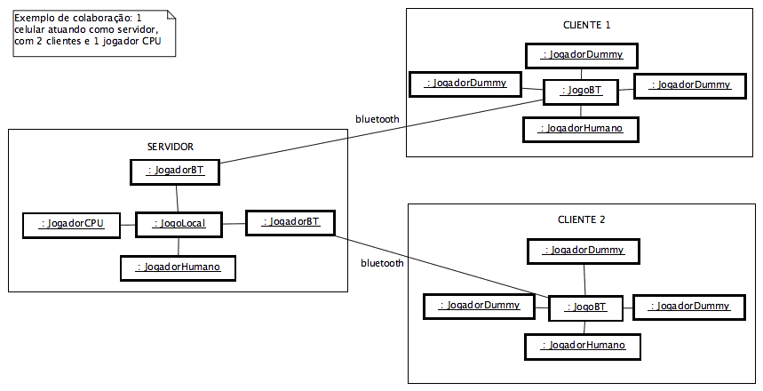

miniTruco J2ME - Documentação do Desenvolvedor
==============================================

_Carlos Duarte do Nascimento (Chester), 2005-2007_

-------

*Aviso: Documentação Descontinuada*
-----------------------------------

*Este arquivo documenta uma versão do miniTruco que **não é mais mantida**, para um [sistema operacional de celulares](https://en.wikipedia.org/wiki/Java_Platform,_Micro_Edition) que não é mais utilizado.*

*O jogo [agora funciona em Android](https://play.google.com/store/apps/details?id=me.chester.minitruco&hl=pt) e o código-fonte (e uma versão atualizada desta documentação) estão disponíveis em [`chesterbr/minitruco-android`](https://github.com/chesterbr/minitruco-android).*

*O documento foi convertido para Markdown para que possa ser visualizado no GitHub, de resto está como eu o deixei em 2007.*

-------

Introdução
----------

O miniTruco é um jogo de Truco feito para dispositivos móveis que possuam J2ME (CLDC) implementando MIDP 1.0 ou superior (em português, "celulares com Java"), que também permite jogo via Bluetooth em dispositivos que implemente a JSR-82.

Seu código-fonte está disponível através da [General Public License (GPL)](http://www.gnu.org/licenses/gpl.txt), sem prejuízo dos [direitos](http://www.gnu.org/licenses/gpl-faq.pt.html) de autor originais. Você pode obtê-lo na [página do projeto no Google Code](http://code.google.com/p/minitruco/), juntamente com esta documentação.

O objetivo deste documento é ajudar desenvolvedores Java a baixar, instalar, entender e aprimorar este código.

Preparação do Ambiente
----------------------

### Pré-Requisitos

A partir da versão 3, a maior parte dos pré-requisitos (bibliotecas e ferramentas) está inclusa no repositório do código. Em conformidade com as licenças destas ferramentas, o arquivo [README\_LIB\_COPYRIGHT.txt](http://minitruco.googlecode.com/svn/trunk/miniTruco/lib/README_LIB_COPYRIGHT.txt) contém os endereços para o download de suas versões completas (já que o diretório só tem os .jar), bem como a descrição do que cada uma delas faz.

O único requisito obrigatório que não está lá é o [JDK](http://java.sun.com). Não é obrigatório, mas recomendo fortemente usar o [Eclipse](http://www.eclipse.org/downloads/) (3.2 ou superior) com o plugin [Subclipse](http://subclipse.tigris.org/).

Se você quiser rodar a aplicação num celular real, pode ser que precise baixar um toolkit J2ME (WTK). Serve um desses:

*   Win32/Linux: [J2ME Wireless Toolkit](http://java.sun.com/products/sjwtoolkit/download-2_2.html)
*   Mac OS X: [MIDP for OS X](http://mpowers.net/midp-osx/)

No restante destas instruções, irei assumir o uso do Eclipse (os masoquistas podem se virar sem - basta o editor respeitar o encoding ISO-8859-1 e chamar o [Ant](http://ant.apache.org/) manualmente).

### Configurando o ambiente

1.  Instale o JDK, se necessário;
2.  Instale o Eclipse (e rode pelo menos uma vez), se necessário;
3.  Instale o Subclipse (não é preciso baixar, basta seguir as [instruções](http://subclipse.tigris.org/install.html));
4.  Na perspectiva _SVN Repository Explorer_, configure o repositório do Subclipse no Google Code (a URL é https://minitruco.googlecode.com/svn para quem já tem cadastro no Google Code, caso contrário use apenas http://. Mais detalhes na [página do projeto no Google Code](http://code.google.com/p/minitruco/));
5.  Abra a pasta tags, dê um clique com o botão direito sobre a pasta com a versão desejada (normalmente a última), e faça um checkout
    (se preferir, baixe a última versão em desenvolvimento de trunk/miniTruco, mas essa não é garantidaemnte estável);

### Verificando a instalação

Se tudo deu certo, você vai ter um projeto, cujo arquivo build.xml permite acionar os targets "executa\_emulador" (que compila e roda no Microemulator) e o "gera\_tudo" (que faz todos os passos para criar o .jar/.jad do jogo). Para este último pode ser preciso alterar o path do WTK no arquivo.

Arquitetura da Aplicação
------------------------

Esta seção dá uma visão geral do papel de cada classe da aplicação. Pressupõe-se que o leitor já tenha jogado o miniTruco (conhecer J2ME ajuda um bocado, mas não é fundamental neste estágio). Os diagramas foram gerados através do [Jude/Community](http://jude.change-vision.com/jude-web/product/community.html), e estão no arquivo [miniTruco.jude](miniTruco.jude).

Após a sua leitura, o [Javadoc](javadoc/index.html) fica bem mais palatável, bem como o código-fonte em si (que pode ser descarregado conforme as instruções acima, ou, se preferir, [navegado diretamente](http://minitruco.googlecode.com/svn/tags/)).

### Classes Principais

O diagrama (figura 1) mostra como as classes do miniTruco se relacionam (os métodos/atributos estão no Javadoc).

A classe [MiniTruco](javadoc/mt/MiniTruco.html) é o ponto de entrada. Ela contém a maior parte dos menus, além de processar os menus de [Mesa](javadoc/mt/Mesa.html) (que é onde a ação do jogo é visualizada).

Figura 1 - Diagrama de Classes (simplificado)

A cada nova partida, um [Jogo](javadoc/mt/Jogo.html) é instanciado. Ele atua como controlador do jogo, conectado a quatro instâncias de [Jogador](javadoc/mt/Jogador.html). Ele informa a cada Jogador os eventos do jogo (início de partida, início de rodada, jogadas efetuadas, de quem é a vez, etc.) e recebe os comandos deles (jogar carta, pedir truco, etc.).

Note que estas classes são abstratas (itálico, no diagrama), ou seja, os objetos são instanciados como descendentes delas, conforme o tipo de jogo. Isso é importante em jogos bluetooth (veremos adiante), mas num jogo "normal" uma instância de [JogoLocal](javadoc/mt/JogoLocal.html) se conecta a um [JogadorHumano](javadoc/mt/JogadorHumano.html) e três [JogadorCPU](javadoc/mt/JogadorCPU.html).

O JogadorHumano interage diretamente com a Mesa, reproduzindo visualmente os eventos informados por Jogo. Qualquer tipo de Jogador possui até três [Carta](javadoc/mt/Carta.html)s na mão (sempre geradas a partir de um [Baralho](javadoc/mt/Baralho.html), para evitar duplicidade), mas as do JogadorHumano desenham a si próprias na Mesa (que conta com a ajuda de um [Animador](javadoc/mt/Animador.html) para movê-las, piscar os placares e animar a tela de abertura.

### Estratégia da CPU

Um jogo de Truco tem sempre quatro jogadores, mas, mesmo via Bluetooth, isso nem sempre é possível. Assim, o jogo é completado com até três JogadorCPU, que não desenham nada na tela (o JogadorHumano cuida de notificar a Mesa para que ela desenhe tanto as cartas dele quanto as dos JogadorCPU).

Estes JogadorCPU estão conectados no jogo da mesma forma que o JogadorHumano (para o Jogo é indiferente, são todos objetos da classe Jogador). Ele não decide como jogar - ao invés disso, delega esta escolha para um objeto da classe [Estrategia](javadoc/mt/Estrategia.html).

O jogo possui atualmente duas delas ([EstrategiaWilian](javadoc/mt/EstrategiaWillian.html) e [EstrategiaSellani](javadoc/mt/EstrategiaSellani.html), batizadas com os nomes dos seus autores), mas qualquer programador pode criar uma estratégia cusotmizada - **mesmo sem conhecer J2ME**, basta entender de Java (e, claro, de Truco).

Para criar uma estratégia customizada, basta criar uma classe que implemente a interface Estratégia (modificar uma das duas acima é uma boa idéia, mas talvez você prefira começar do zero).

Cada um dos métodos corresponde a uma ação que está sendo solicitada ao JogadorCPU, e recebe as informações necessárias para completar a ação.

Por exemplo, o método joga() é chamado quando é a vez daquele jogador, e recebe um objeto SituacaoJogo contendo as cartas na mão do jogador, as que já foram jogadas, as regras do jogo atual, o placar, etc., e, baseado nisso, tem que retornar qual carta o jogador deve jogar (ou 0 para um pedido de truco).

O [javadoc da interface Estrategia](javadoc/mt/Estrategia.html) explica com detalhes o que cada método recebe e deve fazer. Se você criar uma boa estratégia, posso integrá-la no jogo. Quem sabe até dá pra fazer um dia alguma brincadeira online, no estilo do [Robocode](http://robocode.sourceforge.net/)...

### Bluetooth

Apenas as classes com final "BT" usam a API Bluetooth do celular. Na inicialização, a classe MiniTruco verifica se o celular tem Bluetooth (JSR 82), e só neste caso disponibiliza o menu. Desta forma, o jogo pode ser instalado em celulares que não tenham este feature.

Numa partida bluetooth, um celular atua como servidor, e até três celulares-cliente se conectam nele. A oferta/descoberta do serviço é feita pelas classes [ServidorBT](javadoc/mt/ServidorBT) e [ClienteBT](javadoc/mt/ClienteBT) - mas uma vez iniciado o jogo, temos:

*   _Servidor:_ Uma instância de JogoLocal se conecta a um JogadorHumano, além de um [JogadorBT](javadoc/mt/JogadorBT.html) para cada cliente conectado. Os vazios são preenchidos com JogadorCPU;
*   _Cliente:_ Uma instância de [JogoBT](javadoc/mt/JogoBT.html); se conecta a um JogadorHumano e três [JogadorDummy](javadoc/mt/JogadorDummy.html).

Na figura 2 vemos um exemplo com três celulares: um servidor e dois clientes. No servidor, a vaga remanescente é preenchida por um JogadorCPU, e cada celular possui um JogadorHumano representando seu "dono". Perceba que o JogadorBT atua como _proxy_ do JogadorHumano no servidor, e o JogoBT como _proxy_ do JogoLocal nos clientes. E o mais importante: nenhum dos objetos não-Bluetooth "sabe" que está envolvido num jogo multiplayer - esta é outra a vantagem de ter Jogo e Jogador abstratos!

Figura 2 - Colaboração num jogo Bluetooth

Esta hierarquia permite que um Jogo trate seus objetos Jogador independente do tipo deles (humano, cpu, etc.), e também que o Jogador interaja com um jogo sem importar se ele é local ou remoto.

Perguntas Freqüentes (FAQ)
--------------------------

_Cadê a versão multiplayer via GPRS?_
Desencanei dela (é difícil achar um celular que consiga conectar direto num servidor não-http). No trunk você só vai encontrar o cliente. Optei por orientar o projeto na direção do Bluetooth.

Se alguém quiser assumir essa bola (o desenvolvimento e manter um servidor no ar), basta pegar as tags serverV1.0 e v2.02.00 (último cliente com suporte a client-server via GPRS).

_Qual versão do Java devo usar?_
Eu usei Java 1.5 (Java 5), mas J2ME pressupõe 1.1, então não devem haver problemas em usar o 1.4 ou 1.6 (Java 6).

_E o Eclipse 3.1?_
Eu desenvolvi 99% do projeto no 3.1, mas atualizei para o 3.2 recentemente. O site do Eclipse diz que não rola abrir o workspace do 3.2 no 3.1, mas vale tentar se você não puder atualizar (mas os refactorings do 3.2 são muito bacanas). Resposta curta: não.

_Porque você usa esse bando de tralha (Antenna, Proguard, etc.) se o J2ME Wireless Toolkit tem tudo isso?_
Porque o kit em questão só roda em Win32/Linux (belo exemplo de aplicação 100% Pure Java, Sun), e eu uso Mac. Além disso, as ferramentas abertas em questão são, a meu ver, mais focadas e eficientes. E com a nova política de libs inclusas, quem usa Eclipse ou Ant pode baixar e sair usando, sem depender de instalar o WTK.

_Freqüentes tem acento?_
Sim, segundo o [Prof. Moreno](http://www.sualingua.com.br/03/03_trema.htm).

Dicas e Observações
-------------------

Você pode rodar o jogo diretamente (aproveitando a compilação que o Eclipse faz em /bin), configurando o menu "Run" para chamar a classe com.barteo.emulator.app.Main e passando em Arguments a string "br.inf.chester.minitruco.cliente.MiniTruco"

Infelizmente, o MicroEmulator não simula o Bluetooth. Para desenvolver este feature eu usei o [Impronto Simulator](http://rococosoft.com/registration_simulator.asp) - uma excelente ferramenta (mencionada até em [tutoriais de Bluetooth da Sun](http://developers.sun.com/techtopics/mobility/midp/articles/bluetooth2/)) que conta com uma versão gratuita para uso não-comercial.

Não posso distribuir aqui porque a licença de uso é personalizada, mas o link acima permite solicitar a mesma, caso alguém queira ver este feature em funcionamento e (como eu) não tenha dois celulares.

Avisos Legais
-------------

Copyright © 2005-2007 Carlos Duarte do Nascimento (Chester) - cd@pobox.com
 
Estratégia da CPU (EstrategiaWillian): Copyright © 2006 Willian Gigliotti - wgigliotti@gmail.com
 
Estratégia da CPU (EstrategiaSellani): Copyright © 2006 Leonardo Sellani

Este programa é um software livre; você pode redistribui-lo e/ou modifica-lo dentro dos termos da Licença Pública Geral GNU como publicada pela Fundação do Software Livre (FSF); na versão 2 da Licença, ou (na sua opnião) qualquer versão.

Este programa é distribuido na esperança que possa ser util, mas SEM NENHUMA GARANTIA; sem uma garantia implicita de ADEQUAÇÂO a qualquer MERCADO ou APLICAÇÃO EM PARTICULAR. Veja a Licença Pública Geral GNU para maiores detalhes.

Você deve ter recebido uma cópia da Licença Pública Geral GNU junto com este programa, se não, escreva para a Fundação do Software Livre(FSF) Inc., 51 Franklin St, Fifth Floor, Boston, MA 02110-1301 USA
